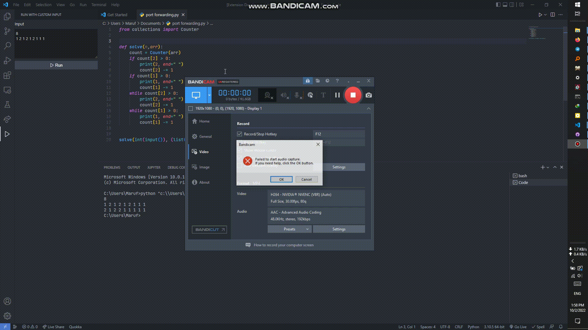

Code Run With Custom Input

This extension helps the user test test cases from platforms like codeforces by keeping making it easier to reuse test case inputs instead of pasting to the terminal again and again

## Features

## Release Notes

### 1.0.0
Initial release of the extension

<a href="https://github.com/Maruf-S/visual-studio-extension-input-ease">Github Repository</a>

**Enjoy!**
